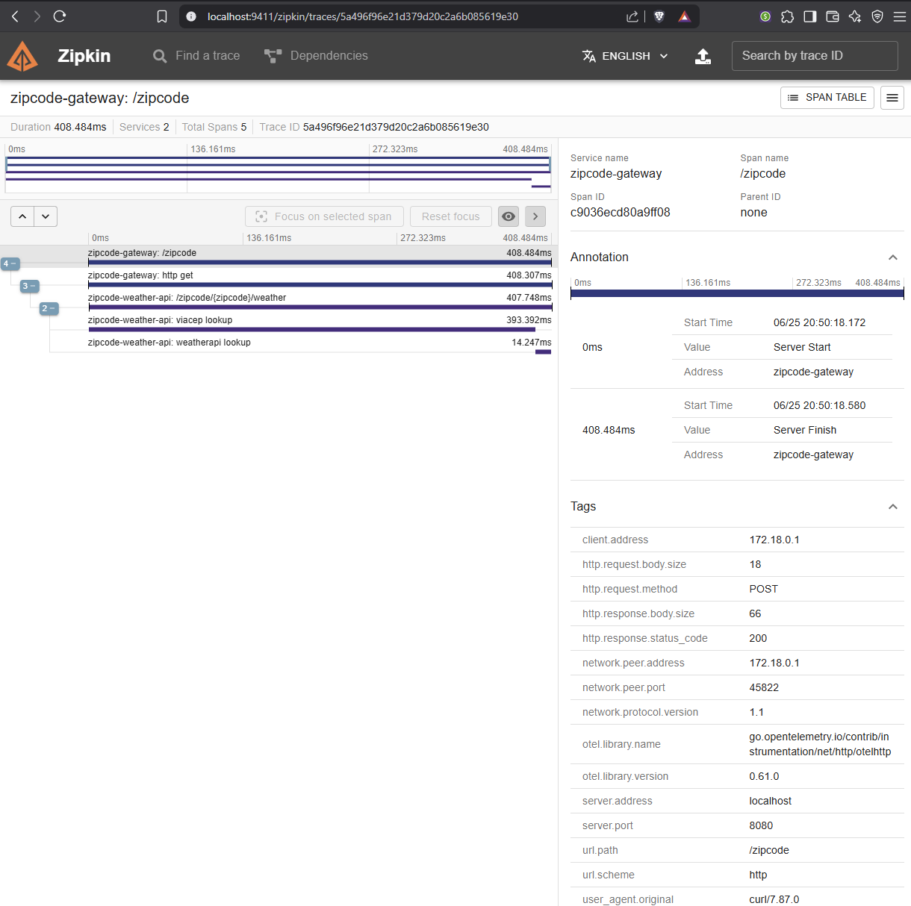
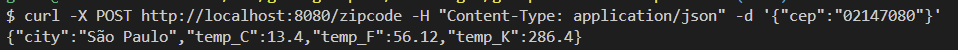
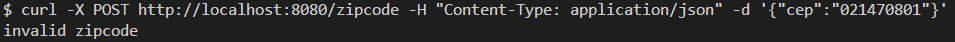
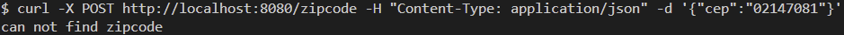

# Sistema de Temperatura por CEP com OTEL e Zipkin

## Objetivo

Desenvolver um sistema em Go que receba um CEP, identifique a cidade e retorne o clima atual (temperatura em graus Celsius, Fahrenheit e Kelvin) juntamente com o nome da cidade.  
Este sistema implementa observabilidade com OTEL (OpenTelemetry) e Zipkin para tracing distribuído.

Baseado no cenário conhecido "Sistema de temperatura por CEP" (Serviço B), foi incluído um novo projeto, denominado Serviço A.

---

## Requisitos

### Serviço A (Gateway - Input)
- Recebe um input de 8 dígitos via POST:  
  Exemplo de schema: `{ "cep": "29902555" }`
- Valida se o input é uma string de 8 dígitos.
- Se válido, encaminha para o Serviço B via HTTP.
- Se inválido, retorna:
  - Código HTTP: 422
  - Mensagem: `invalid zipcode`

### Serviço B (Orquestração)
- Recebe um CEP válido de 8 dígitos.
- Pesquisa o CEP usando a API ViaCEP para encontrar a cidade.
- Consulta a temperatura atual da cidade usando a WeatherAPI.
- Retorna as temperaturas em Celsius, Fahrenheit e Kelvin, juntamente com o nome da cidade.
- Responde adequadamente nos seguintes cenários:
  - **Sucesso:**  
    - Código HTTP: 200  
    - Body: `{ "city": "São Paulo", "temp_C": 28.5, "temp_F": 83.3, "temp_K": 301.65 }`
  - **CEP inválido:**  
    - Código HTTP: 422  
    - Mensagem: `invalid zipcode`
  - **CEP não encontrado:**  
    - Código HTTP: 404  
    - Mensagem: `can not find zipcode`

### Observabilidade
- Implementação de tracing distribuído entre Serviço A e Serviço B usando OTEL e Zipkin.
- Spans para medir o tempo de resposta das buscas de CEP e temperatura.

---

## Tecnologias Utilizadas

- Go 1.22+
- [OpenTelemetry](https://opentelemetry.io/)
- [Zipkin](https://zipkin.io/)
- [ViaCEP API](https://viacep.com.br/)
- [WeatherAPI](https://www.weatherapi.com/)
- Docker e Docker Compose

---

## Como rodar o projeto

### Pré-requisitos

- [Docker](https://www.docker.com/) e [Docker Compose](https://docs.docker.com/compose/)
- Chave da [WeatherAPI](https://www.weatherapi.com/)

### Passos

1. **Configure a variável de ambiente:**
   - Crie um arquivo `.env` na raiz do projeto:
     ```
     WEATHER_API_KEY=sua_chave_weatherapi
     ```
2. **Suba todos os serviços com Docker Compose:**
   ```sh
   docker-compose up --build
   ```
   Isso irá subir:
   - Serviço A (gateway) na porta 8080
   - Serviço B (weather-api) na porta 8081
   - OTEL Collector
   - Zipkin (acessível em http://localhost:9411)

3. **Testando a API**
   - Envie um POST para o gateway:
     ```sh
     curl -X POST http://localhost:8080/zipcode -H "Content-Type: application/json" -d '{"cep":"02147080"}'
     ```
   - Resposta esperada:
     ```json
     {
       "city": "São Paulo",
       "temp_C": 28.5,
       "temp_F": 83.3,
       "temp_K": 301.65
     }
     ```

4. **Observando traces**
   - Acesse o Zipkin em [http://localhost:9411](http://localhost:9411) para visualizar os traces distribuídos.

---

## Estrutura do Projeto

```
.
├── internal/
│   ├── entity/         # Entidades de domínio e interfaces
│   ├── usecase/        # Casos de uso (regras de negócio)
│   └── infra/
│       ├── repo/       # Repositórios (integração com APIs externas)
│       └── web/        # Handlers HTTP e servidor web
├── zipcode-gateway/    # Serviço A (Gateway)
├── zipcode-weather-api/# Serviço B (Weather API)
├── docker-compose.yaml
├── otel-collector-config.yaml
└── README.md
```

---

## Observabilidade

- O tracing distribuído é implementado com OpenTelemetry.
- O OTEL Collector exporta os traces para o Zipkin.
- Spans são criados para as chamadas à ViaCEP e WeatherAPI, permitindo análise detalhada de performance e rastreabilidade ponta-a-ponta.

---

## Evidências de Teste

As evidências de teste (prints, logs, exemplos de requisição/resposta) estão disponíveis na pasta `test-evidence/` deste repositório.

Evidência:









---
